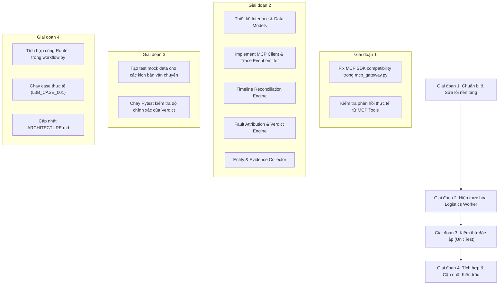

# KẾ HOẠCH THỰC THI: LOGISTICS WORKER
**Dự án:** K4 L3B Multi-Agent MCP A2A — Xử lý khiếu nại sàn TMĐT Olist  
**Phụ trách:** Nguyễn Văn Giáp (Logistics Worker)  
**Mục tiêu:** Hoàn thiện module `logistics_worker.py`, đối soát chính xác hành trình đơn hàng, phân định lỗi Shipper vs Seller, ghi nhận Trace Event và bàn giao payload chuẩn schema cho Supervisor/Router.

---

## 🗺️ LỘ TRÌNH TỔNG QUAN

---

## 📋 CHI TIẾT CÁC TASK BREAKDOWN

### Giai đoạn 1: Chuẩn bị & Sửa lỗi nền tảng (Foundation & Fixes)
  
- [ ] **Task 1.1: Xác thực dữ liệu trả về từ 3 MCP Shipment Tools**
  - **Công cụ:** `get_order`, `get_order_items`, `get_shipment_summary`.
  - **Chi tiết:** Viết script kiểm tra nhanh để nắm chắc schema dữ liệu thực tế mà server Olist trả về cho từng tool.

---

### Giai đoạn 2: Xây dựng Module Logistics Worker (`logistics_worker.py`)

- [ ] **Task 2.1: Định nghĩa Interface & Handoff Contract**
  - **File:** `src/student_agent/logistics_worker.py`
  - **Chi tiết:** Khai báo kiểu dữ liệu trả về `LogisticsResult` chuẩn hóa gồm:
    - `shipment_analysis`: `{verdict, late_seller_ids, timeline_complete}`
    - `entities`: `{seller_ids, item_ids, shipment_ids}`
    - `evidence_refs`: danh sách mã `ev_...`
    - `primary_issue_candidate`: `late_delivery_seller` | `late_delivery_logistics` | None
    - `root_cause_candidate`: bên chịu trách nhiệm (`seller` | `logistics_provider`).

- [ ] **Task 2.2: Implement truy vấn MCP & Bắn Trace Event**
  - **Chi tiết:**
    - Gọi tuần tự hoặc song song (có kiểm soát lỗi) 3 tool: `get_order`, `get_order_items`, `get_shipment_summary`.
    - Ghi nhận `trace.emit(..., event_type="tool_result_consumed", actor="logistics_worker", tool_name=..., evidence_refs=[...])` ngay sau mỗi lệnh gọi thành công.
    - Xử lý graceful degradation nếu 1 trong các tool trả về rỗng hoặc lỗi.

- [ ] **Task 2.3: Xây dựng Bộ chuẩn hóa thời gian (Datetime Normalizer)**
  - **Chi tiết:**
    - Hàm parse an toàn chuỗi ISO 8601 (có timezone offset như `-03:00` của Brazil) sang `datetime`.
    - Xử lý các giá trị `null`, rỗng hoặc định dạng đặc biệt.

- [ ] **Task 2.4: Xây dựng Logic đối soát hành trình (Timeline Reconciliation)**
  - **Chi tiết:**
    1. Kiểm tra tính toàn vẹn mốc thời gian: `timeline_complete` = `True` khi có đủ ngày giao khách thực tế, ngày hẹn giao, ngày giao bưu tá và hạn giao của seller.
    2. So sánh hạn bàn giao của Seller:
       - Lấy mốc `order_delivered_carrier_date` (hoặc từ shipment summary).
       - So sánh với `shipping_limit_date` của từng sản phẩm trong `order_items`.
       - Nếu `carrier_date > shipping_limit_date` $\rightarrow$ Đưa `seller_id` vào `late_seller_ids`.
    3. So sánh hạn giao hàng cho Khách:
       - So sánh `order_delivered_customer_date` với `order_estimated_delivery_date`.
       - Xác định đơn có bị trễ hẹn với người mua hay không.

- [ ] **Task 2.5: Xây dựng Bộ phân định trách nhiệm (Fault Attribution Engine)**
  - **Chi tiết:** Phân loại chính xác `verdict` theo Schema:
    - `"on_time"`: Giao cho khách đúng hạn hoặc sớm hơn, seller giao đúng hạn.
    - `"seller_delay"`: Khách nhận trễ VÀ Seller bàn giao trễ cho bưu tá (`late_seller_ids` không rỗng).
    - `"logistics_delay"`: Khách nhận trễ NHƯNG Seller bàn giao đúng hạn (`carrier_date <= shipping_limit_date`).
    - `"lost"`: Trạng thái đơn hoặc event chỉ ra thất lạc / quá hạn không tới.
    - `"returned"`: Hàng hoàn về kho hoặc quay đầu.
    - `"conflicting"`: Trạng thái hoặc mốc thời gian giữa các bảng mâu thuẫn trực tiếp.
    - `"insufficient_evidence"`: Thiếu dữ liệu mốc thời gian cốt lõi để kết luận.

---

### Giai đoạn 3: Kiểm thử Đơn vị & Xác thực Độc lập (Unit Testing)

- [ ] **Task 3.1: Xây dựng Unit Test độc lập**
  - **File:** `tests/test_logistics_worker.py`
  - **Chi tiết:** Mock kết quả MCP và kiểm tra 6 kịch bản cốt lõi:
    1. Test kịch bản `on_time`.
    2. Test kịch bản `seller_delay` (bắt đúng danh sách `late_seller_ids`).
    3. Test kịch bản `logistics_delay` (seller đúng hạn, shipper giao chậm).
    4. Test kịch bản thiếu mốc thời gian (`timeline_complete = False`).
    5. Test kiểm tra bắn đủ trace event `tool_result_consumed`.
    6. Test thu thập đầy đủ các `evidence_refs`.

- [ ] **Task 3.2: Chạy kiểm thử và tối ưu code**
  - **Lệnh:** `pytest tests/test_logistics_worker.py -v`

---

### Giai đoạn 4: Tích hợp Hệ thống & Hoàn thiện Tài liệu (Integration & Docs)

- [ ] **Task 4.1: Cập nhật Bảng sở hữu Agent trong `ARCHITECTURE.md`**
  - **File:** `ARCHITECTURE.md`
  - **Chi tiết:** Điền thông tin dòng `Shipment`:
    - *Input:* `case_id`, `order_id`
    - *Trách nhiệm:* Đối soát timeline, phân định lỗi Shipper vs Seller, phát hiện late seller.
    - *Tool permission:* `get_order`, `get_order_items`, `get_shipment_summary`.
    - *Output/handoff:* `shipment_analysis`, `late_seller_ids`, `evidence_refs`, `entities`.

- [ ] **Task 4.2: Tích hợp với Router Agent (`workflow.py`)**
  - **Chi tiết:** Cung cấp hàm `investigate_shipment(case_id, order_id, gateway, trace)` để Supervisor gọi trong quy trình A2A.
  - Chạy thử nghiệm trên case thực tế: `inputs/L3B_CASE_001.json`.

---

## ⏱️ THỜI GIAN DỰ KIẾN & CHECKPOINTS

| Giai đoạn | Thời lượng ước tính | Checkpoint bàn giao |
| :--- | :--- | :--- |
| **Giai đoạn 1** | 15 phút | MCP Gateway gọi mượt mà không crash |
| **Giai đoạn 2** | 45 phút | `logistics_worker.py` hoàn thành đầy đủ logic |
| **Giai đoạn 3** | 20 phút | 100% Unit test pass với pytest |
| **Giai đoạn 4** | 20 phút | Tích hợp thành công vào `workflow.py`, cập nhật `ARCHITECTURE.md` |
